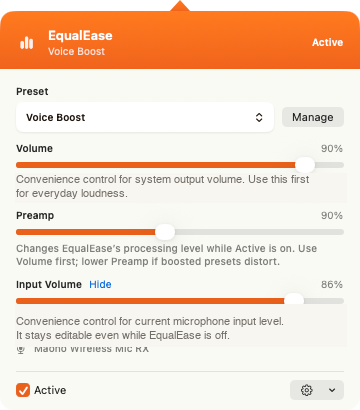

# EqualEase

The equalizer your Mac is missing.

EqualEase gives you one simple place to adjust everyday Mac audio. Tune your laptop speakers, headphones, external speakers, or sound system for better music, clearer calls, and fewer “why does this sound bad?” moments.

It lives in the menu bar, works across your Mac, and keeps the controls easy to understand.



## Get EqualEase

[Download EqualEase on the Mac App Store](https://apps.apple.com/app/equalease/id6767109153?mt=12)

EqualEase is available as a signed, packaged Mac App Store app with updates through Apple. This repository remains source-available: if you are comfortable building it yourself, you can use it for free for personal and non-commercial use under the license below.

The App Store version is for the easiest install and updates; it does not unlock a separate feature set.

## Highlights

- **One menu bar control for everyday Mac audio.** Quickly adjust output volume, input volume, presets, EQ, and routing from one place.
- **System-wide EQ.** Shape audio from calls, music, videos, games, browsers, and system sound instead of being tied to one player app.
- **Presets that make sense.** Start with built-in presets, then save custom presets for your own speakers, headphones, or listening setup.
- **Mic volume guard.** Get warned when input volume drops, with optional protection to bring it back up before people cannot hear you.
- **Remote control.** Adjust volume, preamp, and presets from a phone on your local network when your Mac is across the room or connected to speakers.
- **Native Mac feel.** EqualEase stays out of the way until you need it, with a focused menu bar panel and a native Settings window.

## Features

- System-wide macOS audio EQ using Core Audio routing.
- Menu bar quick panel with active state, preset selection, output volume, input volume, preamp, and routing controls.
- Native Settings window for General, Presets, Rules, and Diagnostics.
- 10-band graphic EQ workbench with draggable band knobs.
- Built-in presets plus custom preset save, rename, delete, and revert flows.
- Optional active-app preset rules learned from user choices.
- Low microphone volume notifications and optional input-volume capping.
- Opt-in local-network remote control with pairing.

## AI-assisted development

EqualEase was built with substantial AI assistance, but not by blindly shipping generated code. The app was developed with continuous human direction, review, and testing throughout by an experienced software developer, including product decisions, architecture, implementation checks, privacy review, and App Store preparation.

## License

EqualEase is source-available for free personal and non-commercial use under the [PolyForm Noncommercial License 1.0.0](LICENSE).

You may build it yourself from source for personal use. Commercial use, including selling copies or paid redistribution of modified versions, is not allowed under the public license. Commercial rights are reserved by the copyright holder.

This is not an OSI open-source license. It is intended to keep EqualEase free to self-build while preventing someone else from copying it and selling it.

## Build from source

### Requirements

- macOS with support for Core Audio process taps.
- Xcode with command line tools installed.
- [mise](https://mise.jdx.dev/) for the documented build tasks.
- An Apple Developer Team ID only if you want signed local builds or App Store archives.

### Build and test

From the repository root:

```sh
mise run build
```

This performs an unsigned Debug build, so you do not need the maintainer's Apple Developer Team ID to check out and build the app.

Run tests:

```sh
mise run test
```

For signed local builds or App Store archive creation, copy the local config example and set your own Apple Developer Team ID:

```sh
cp mise.local.example.toml mise.local.toml
```

```toml
[env]
EQUALEASE_DEVELOPMENT_TEAM = "YOUR_TEAM_ID"
```

Then run:

```sh
mise run build-signed
mise run archive-app-store
```

`archive-app-store` creates a Release `.xcarchive` at `build/EqualEase.xcarchive`. It does not upload the archive to App Store Connect.

### Install locally

To build from source and install the app into `/Applications`:

```sh
scripts/install-local.sh
```

The install script builds EqualEase in Release configuration, quits any running instance, replaces `/Applications/EqualEase.app`, registers it with Launch Services, and launches it.

Useful options:

```sh
scripts/install-local.sh --debug
scripts/install-local.sh --no-launch
scripts/install-local.sh --destination /path/to/EqualEase.app
```

After installing, open EqualEase from `/Applications` and grant any macOS audio/system permissions it requests.
